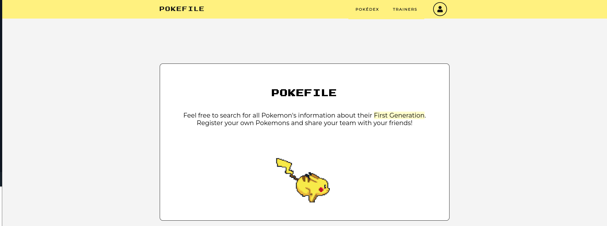

# Pokéfile

Pokéfile é um projeto final da disciplina de Banco de Dados I do curso de Ciência da Computação da Universidade Federal do Rio de Janeiro (UFRJ).

O objetivo do sistema é realizar buscas relacionadas aos Pokémons (da primeira geração). As informações da nossa aplicação são todas obtidas através da PokéAPI (<a href="http://pokeapi.co" target="_blank">http//pokeapi.co</a>).

### Tela de pesquisa de informações da aplicação

### Especificações
As especificações de implementação na programação do projeto, foram:
- Consultas envolvendo operações de seleção e projeção;
- Consultas envolvendo a junção de apenas duas relações, sendo que uma deve conter junção externa;
- Consultas envolvendo a junção de três ou mais relações;
- Consulta envolvendo operações sobre conjuntos;
- Consultas envolvendo funções de agregação.

### Informações do projeto
- Aplicação Front-end: React.js/Typescript
- Aplicação Back-end: Express.js/Typescript;
- SGBD MySQL (obrigatório) c/ PrismaORM.

As demais informações de como inicializar o projeto está dentro do README.md das respectivas pastas web / api.

### Desenvolvimento da aplicação
- Nathan Andrade
- Bruna Ribeiro